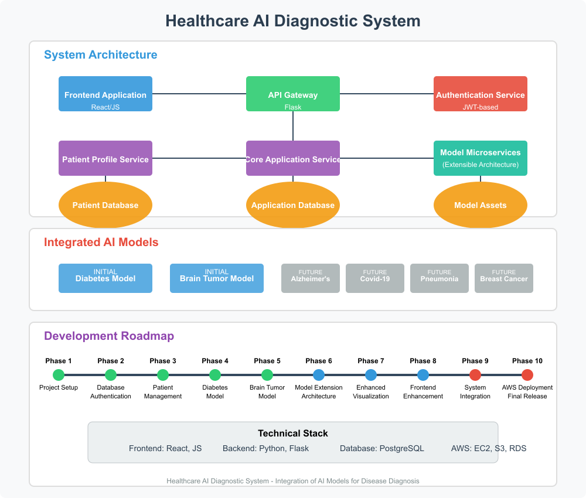

# Healthcare AI Diagnostic System

| [📋 Overview](#1-project-overview) | [🏗️ Architecture](#2-system-architecture) | [💻 Tech Stack](#3-technical-stack) | [✨ Features](#4-feature-breakdown) |
|:--------------------------------:|:---------------------------------------:|:--------------------------------:|:--------------------------------:|
| [🔄 Integration](#5-integration-strategy-for-disease-models) | [📊 Data Flow](#6-data-flow-and-processing) | [🎨 UI Design](#7-user-interface-design-principles) | [📝 Conclusion](#8-conclusion) |

## Demo

<video width="640" height="360" controls>
  <source src="./frontend/src/assets/video/PFA.mp4" type="video/mp4">
  Your browser does not support the video tag.
</video>

## 1. Project Overview

This project aims to develop a healthcare AI diagnostic system that  integrates six disease prediction models (Diabetes, Brain Tumor, Alzheimer's, Covid-19, Pneumonia, and Breast Cancer) to assist healthcare professionals in quickly and accurately diagnosing patients.

### Core Objectives

- Provide healthcare professionals with fast and accurate diagnostic assistance
- Maintain a secure environment for patient data
- Enable effective patient profile management and historical record-keeping

---

## 2. System Architecture

The system will follow a microservice architecture pattern, with the following components:

### High-Level Architecture

  

### Key Components

- **Frontend Application**: React/JS-based UI
- **API Gateway**: Manages requests between frontend and various backend services
- **Authentication Service**: Handles user authentication and authorization
- **Patient Profile Service**: Manages patient data and medical records
- **Core Application Service**: Orchestrates the diagnostic workflow
- **Model Microservices**: Two separate services for each disease prediction model
- **Databases**: Secure storage for patient data, application data, and model assets

---

## 3. Technical Stack

### Frontend

- **Framework**: React.js
- **State Management**: Redux

    Redux would allow patient data to be accessed from any component without passing it through multiple layers, and would ensure that updates to that data follow a consistent, trackable pattern.
- **UI Components**: Material-UI or Ant Design (for medical-appropriate UI elements)

### Backend

- **API Framework**: Python with Flask
- **Model Serving**: Flask API endpoints
- **Authentication**: Simple JWT-based authentication

### Data Storage

- **Primary Database**: Amazon RDS (PostgreSQL)
- **Image Storage**: Amazon S3 with server-side encryption
- **Caching**: Amazon ElastiCache

### DevOps

- **Containerization**: Docker
- **Version Control**: GitHub

---

## 4. Feature Breakdown

### 1. Authentication and User Management

- Secure login system for healthcare professionals
- Role-based access control
- Session management

### 2. Patient Profile Management

- Create, view, update, and archive patient profiles
- Searchable patient directory
- Patient demographic information
- Medical history tracking

### 3. Image-based Diagnostics

- Image upload interface
- Image preprocessing and validation
- Model prediction with confidence scores
- Results storage

### 4. Tabular Data Diagnostics

- Structured data entry forms
- Data validation and normalization
- Model prediction with confidence scores and contributing factors
- Results interpretation

### 5. Patient Health Records

- Chronological view of diagnoses
- Admission and diagnosis dates tracking
- Results history
- Medical notes
- Image gallery of uploaded diagnostic images

---

## 5. Integration Strategy for Disease Models

### Models

- **Diabetes Model**: Tabular data-based prediction
- **Breast Cancer**: Tabular
- **Brain Tumor Model**: Image-based diagnosis
- **Alzheimer's**: Image-based diagnosis
- **Covid-19**: Image-based diagnosis
- **Pneumonia**: Image-based diagnosis

### Approach: Modular Flask API Architecture

Models will be integrated through Flask API endpoints with a focus on extensibility:

1. **Standardized Interfaces**: All models will follow a consistent API pattern to facilitate future additions
2. **Modular Design**: Clear separation between model logic and API routes
3. **Extensible Framework**: Design patterns that make adding new models straightforward
4. **Versioning**: Simple versioning for model updates

### Implementation Details

- Models will be loaded dynamically into the Flask application
- `Abstract factory` pattern for model initialization
- `Strategy pattern` for handling different input types (tabular vs. image)
- Flask routes will handle preprocessing, prediction, and result formatting
- Simple error handling and basic logging
- Use of Python libraries (TensorFlow, scikit-learn, etc.) for model inference

---

## 6. Data Flow and Processing

### Image-based Diagnostic Flow

1. Doctor uploads image through the UI
2. Image is validated, normalized, and securely stored in S3
3. Appropriate model microservice is called based on the diagnostic test selected
4. Model processes the image and returns predictions with confidence scores
5. Results are processed, and presented to the doctor
6. Final results are saved to the patient's profile

### Tabular Data Diagnostic Flow

1. Doctor enters patient data through structured forms
2. Data is validated and normalized
3. Appropriate model microservice is called
4. Model processes the data and returns predictions with confidence scores and factors
5. Results are processed, and presented to the doctor
6. Final results are saved to the patient's profile

---

## 7. User Interface Design Principles

The UI will balance modern dashboard elements with traditional medical interfaces, focusing on:

### Design Principles

- **Clarity**: Clear hierarchy and organization of information
- **Efficiency**: Minimize clicks and streamline workflows
- **Consistency**: Uniform patterns and interactions
- **Feedback**: Clear system status and confirmation messages
- **Error Prevention**: Validation and confirmation for critical actions

### Key UI Components

- **Dashboard**: Overview of recent patients and activities
- **Patient Management**: Search, filter, and manage patient profiles
- **Diagnostic Interface**: Upload images or enter data with clear guidance
- **Results View**: Visualizations with heatmaps, confidence scores, and interpretations
- **Patient History**: Timeline view of patient's diagnostic history

---

## 8. Administrator Access

The system provides special privileges for administrators who manage the platform.

### Administrator Capabilities

Administrators have access to a comprehensive analytics dashboard that provides:

- **User Statistics**: Monitor total patient count and registered doctors
- **Disease Analytics**: View percentage distribution of specific diseases across patients
- **Temporal Data Visualization**: Access interactive line charts showing patient registration trends by day, week, and month
- **Performance Metrics**: Track system usage patterns and diagnostic model accuracy
- **Reporting Tools**: Generate and export detailed reports for administrative purposes

The dashboard interface features responsive design with filterable data views to support data-driven decision making and resource allocation.

## 8. Conclusion

This Healthcare AI Diagnostic System will provide a powerful tool for healthcare professionals to leverage AI for faster, more accurate diagnoses. By integrating six specialized disease prediction models into a unified, secure platform, the system will help improve patient care, reduce diagnostic delays, and enhance clinical decision-making.

The microservice architecture ensures modularity, scalability, and maintainability, while the balanced UI design provides an intuitive experience for healthcare professionals. With a phased development approach, the system can be built incrementally, allowing for continuous feedback and improvement throughout the development lifecycle.